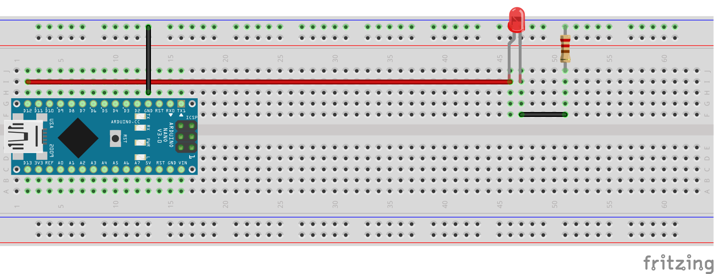
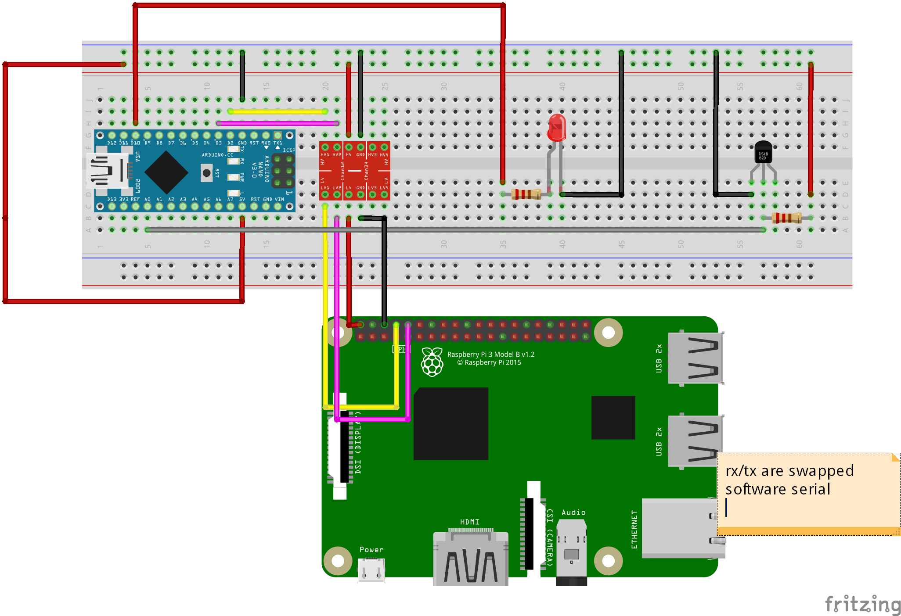
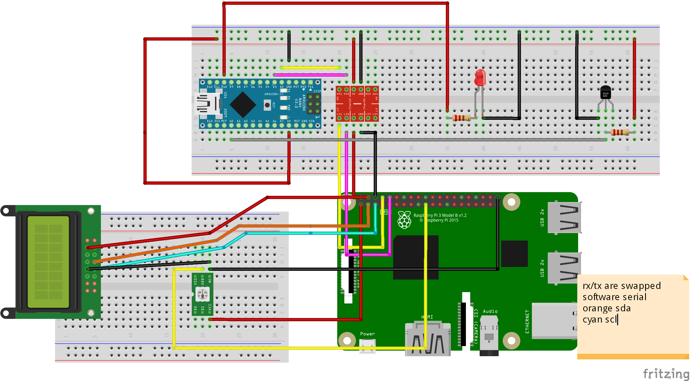
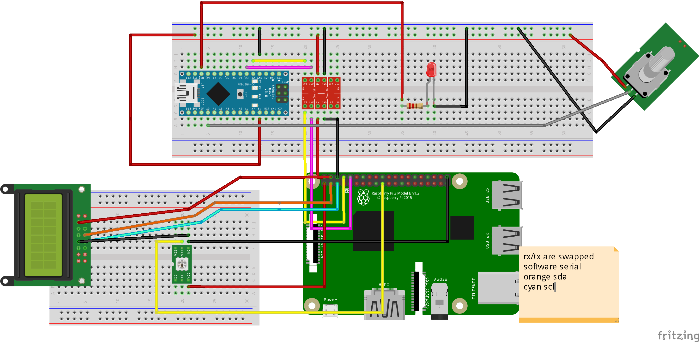
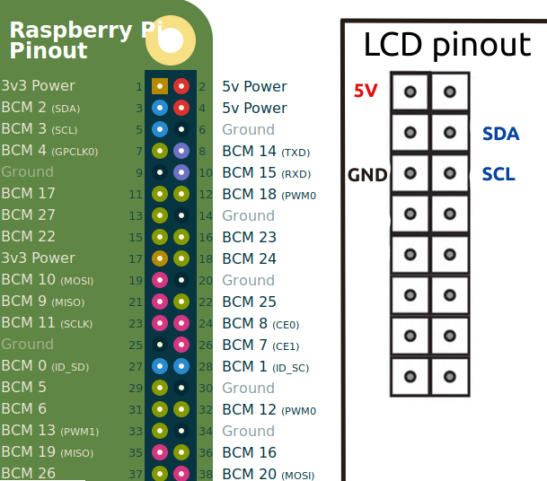
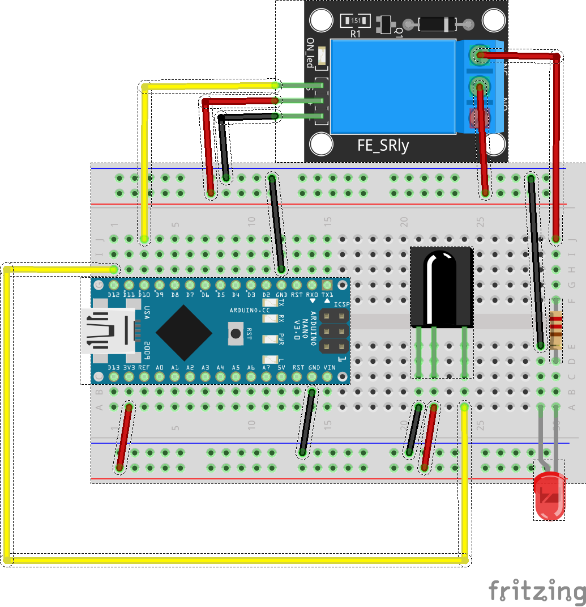
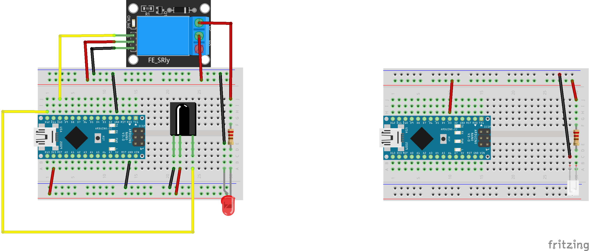
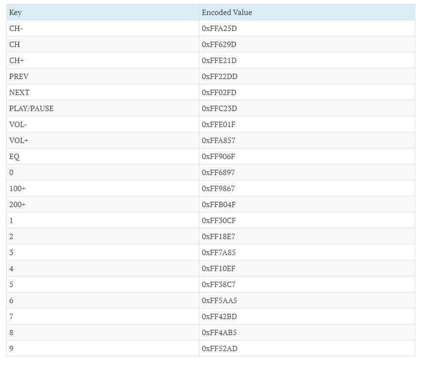

# smart_solutions
course repo for storing codes
perhaps aiming at being better manual

## LAB 1
sorry mens
## LAB 2
sorry mens
## LAB 3
Configure raspi for serial usage first

### Task 1

- use example blink programm

- SOS signal blinks are 3short 3long 3short

### Task 2

Wiring diagram for whole task (unchecked). 

### Task 3
- install neopixel, onewire, dallas temperature sensor, library
- add addressable LED to raspi, yellow goes to GPIO pin 10. (named 19)

- connect LCD screen as mentioned in lab 4 task manual here
- add according diplay functions to code

- when task fnished in next one swap out temperature sensor for potentio meter, adjust mapping max,min values and DONE!

## LAB 4
Suggestion to use two arduinos one master other slave.
Master has connected LCD
Slave has connected sensors

`NB. If you use Wemos modules then pins are reffered by their full names as D4 and A0, instead of usual 4 and A0. For Wemos Arduino libraries and module support has to be set up. Bluetooth connection can be unstable and dissapear.
People with iPhone find Android friend for task1.`
### Task 1 
- Connect bluetooth module. Use Arduino 3v3 for LV. Use 5V pin for HV. Arduino RX and TX for HV1 HV 2. Then accordingly from LV1 and LV2 attach to bluetooth module (RX and TX has to swapped).
- Install android application bluetooth serial controller 16. Choose display terminal and portrait settings.
- Conect with phone to Bluetooth module.
- Write script that allows you to type in message, mesage send to phone. Messages sent from phhone also are displayed in Arduino serial monitor.

### Task 2
- connect both arduinos, launch on one master script on another slave script

### Task 3
- add relay to master, upon receiving approapriate message switch it on/off
### Task 4
`Add a display to one of the Arduinos to receive data and a sensor to another Arduino to collect the data. Send the data form one Ardunio to another over BT and show in the display. The connection can be established between two lab partners. Both of the counterparts have to write separately both the client side and server side code. Show the result of of the codes of all participants to the supervisor. Upload the codes and photos of hardware implementations into the moodle.`

- Connect LCD to master
- Connect sensor to slave

Slave makes measurments and spams them to master, master displays them.

LCD to ARDUINO pins. 
- Analog Pin 4 (A4) - SDA
- Analog pin 5 (A5) - SCL
- 5V - Vcc
- GND - GND

Add needed code parts in Master codes.
For reading about  LCD codes to use : https://create.arduino.cc/projecthub/akshayjoseph666/interface-i2c-16x2-lcd-with-arduino-uno-just-4-wires-273b24

Add necessary codes parts from this nice temperature sensor overview.
For reading about temperature sensor. https://create.arduino.cc/projecthub/TheGadgetBoy/ds18b20-digital-temperature-sensor-and-arduino-9cc806

## LAB 5

### Task 1
`
Add a relay to an Arduino (master) to switch on and off a LED. Add an IR receiver to the master. Make the IR receiver to recieve and recognise the signals from a remote control. Switch the LED on and off using the remote control. Show the result to the supervisor. Upload master's code into the moodle.
`
Code and background reading. 
Smth: https://osoyoo.com/2018/08/29/arduino-lesson-ir-remote-receiver-module-and-controller/
Receiving https://www.circuitbasics.com/arduino-ir-remote-receiver-tutorial/
Keycodes https://www.exploreembedded.com/wiki/index.php?title=NEC%20IR%20Remote%20Control%20Interface%20with%208051

- connect relay, add LED to that
- connect IR receiver
- upon receiving sertain value enable/disable relay 

### Task 2
`
Take another Arduino, Wemos D1 Mini or RasPi (client). Add an IR LED to the client. Map the codes of your remote control. Send this codes over IR LED to the master and switch the LED on and off. Show the result to the supervisor. Upload the code of the client to the moodle.
`
- connect IR led to another Arduino Digital 3, transmit smth
- receive on master arduino and switch on LED

## LAB 6